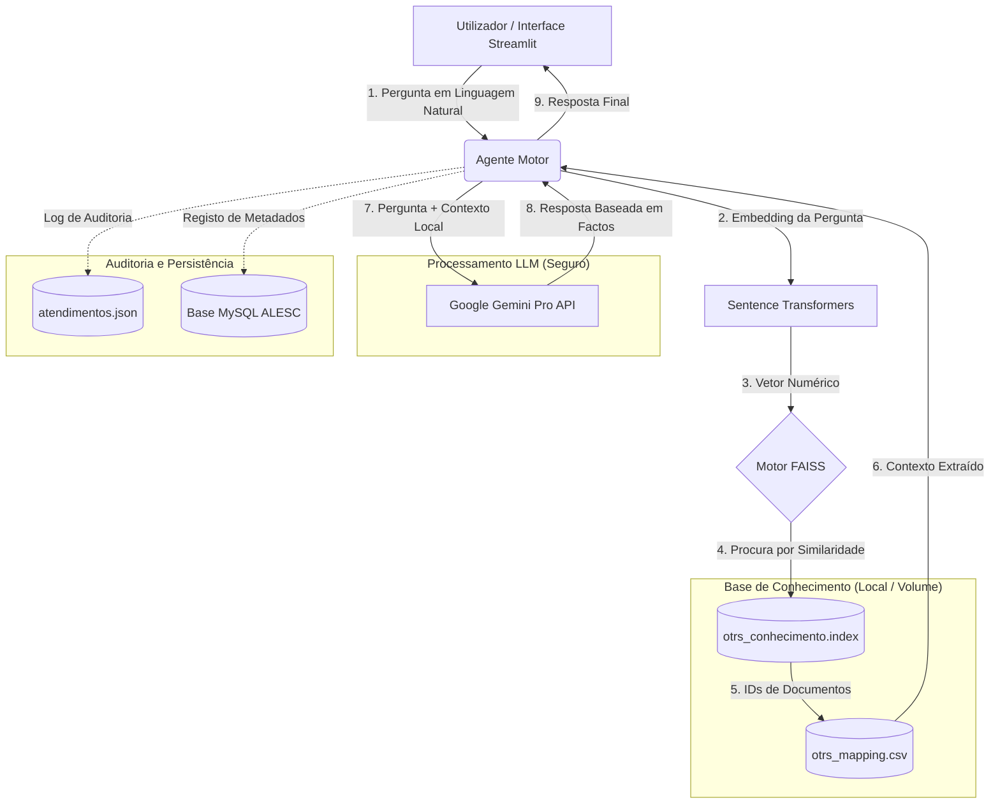

Arquitetura Técnica: Agente de IA ALESC

Este diagrama descreve o fluxo de dados desde a pergunta do utilizador até à resposta final, destacando a técnica de RAG (Retrieval-Augmented Generation) e o isolamento em Docker.

1. Fluxo de Execução (Diagrama de Arquitetura)

2. Pontos Chave para a Apresentação (TI)

A. Porquê RAG?

Diferente de um chat comum, o sistema consulta primeiro a Base de Conhecimento Local (arquivos binários no volume Docker). A IA só responde com base no que encontrar nesses ficheiros, evitando "alucinações" e garantindo que as respostas seguem os manuais da ALESC.

B. Performance e Motor de Busca (FAISS)

O uso do motor FAISS (Facebook AI Similarity Search) permite que a busca em milhares de registos do OTRS aconteça em milissegundos. A configuração de memória compartilhada (shm_size: 2gb) no Docker é o que permite esta alta performance em CPU.

C. Segurança e Privacidade

Isolamento: Tudo corre dentro de containers Docker, sem interferir no sistema operativo do servidor.

Dados: Os dados sensíveis residem no volume físico da ALESC e não são usados para treinar modelos públicos de IA.

Auditabilidade: O ficheiro atendimentos.json permite uma auditoria completa de cada interação realizada pelo agente.

Responsável Técnico: Edson Bez

Tecnologia: RAG Architecture com Docker Deployment